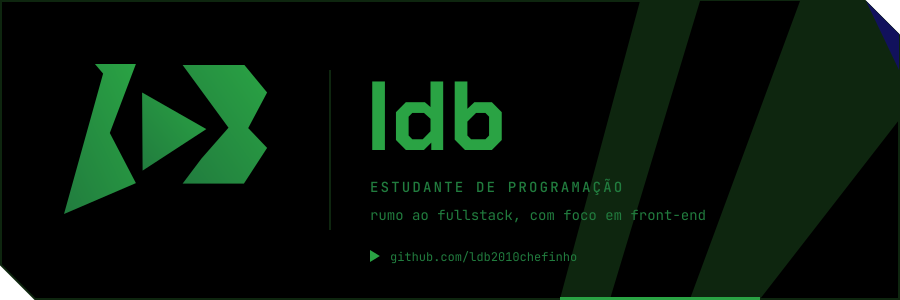
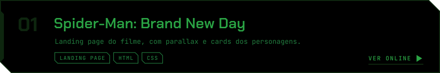
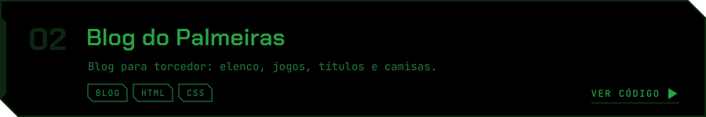
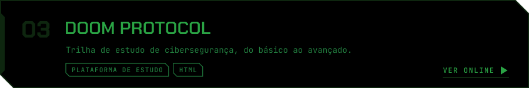
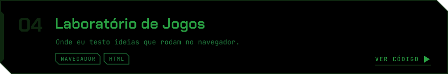
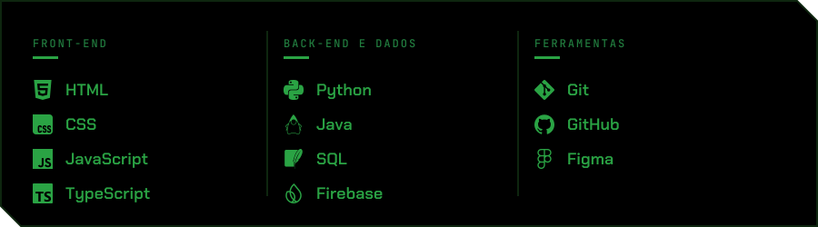

  

Estudando várias linguagens ao mesmo tempo. A maior parte do tempo vai para o front: HTML, CSS, JavaScript e TypeScript. Python, Java e SQL entram para cobrir o outro lado.

Fora do código: Marvel, DC e videogame.

  

<picture>
  <source media="(prefers-color-scheme: dark)" srcset="https://raw.githubusercontent.com/ldb2010chefinho/ldb2010chefinho/output/snake-dark.svg">
  <source media="(prefers-color-scheme: light)" srcset="https://raw.githubusercontent.com/ldb2010chefinho/ldb2010chefinho/output/snake-light.svg">
  
</picture>
